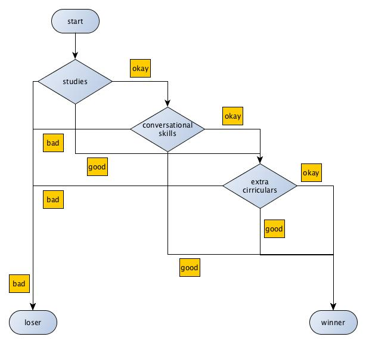

# Decision Tree
Decision Tree is a classification algorithm. It's used to classify
data into "groups". For example, pupils in school can be classified
into "winners" and "losers", based on their characteristics, like
their interest in studies, participation in extra-curricular 
activities, conversational skills, etc. Each of these features can
take discrete and bound values. In the above example, the feature
"conversational skills" can have values in the set ( "good", "okay"
, "bad" ). Based on the value of the features, the algorithm tries
to predict if the pupil is a "winner" or a "loser". To do so, the
algorithm should be trained with some data, for it to know what
values of each feature contribute to classification.

## Implementation
Decision tree works much like a flowchart. The input data is 
classified into groups based on their feature values until all the
features are exhausted or all the data belong to the same group.
For the example mentioned above, here's a decision tree, based on
the training data below:
```
Pupil   Studies     Conversations   Extra-Curricular    Category
Arun    Good        Good            Good                Winner
Bala    Good        Okay            Okay                Winner
Cara    Good        Good            Bad                 Winner
Dana    Bad         Bad             Okay                Loser
Ergo    Okay        Okay            Bad                 Loser
...
```



There are three features for the above data, and each of the 
features have three distinct values. So, where do we start 
categorizing the data? There are three features, and we can 
split the data based on all of them. Should we split based on
"studies" or "conversations" or "extra-curriculars" first? This 
is the biggest and most important point of decision-tree 
algorithm. The answer is: we split the data based on the feature 
that gives highest information gain or lowest entropy at each
step.

## Entropy
Entropy is a measure of degree of disorderness of a system. It 
has no SI unit associated with it. Let's take an example: water.
Water in solid state has lower entropy than water at liquid state
because in liquid state the molecules can move very easily: the
water can flow freely as a liquid. Similarly, entropy of water at
gaseous state(water-vapor) is higher than the liquid state as the
molecules are more random and can move freely up. 

The same concept can be applied to information theory.  

 
